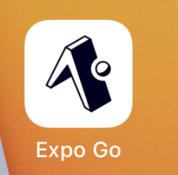

# App Mobile Crossword

## Introduction
Welcome to the Crossword Solver App! This application allows users to upload images of crossword grids and definitions, processes them, and displays the crossword puzzle with clues. The app is built using React Native for the frontend and Flask for the backend.

## Features
- Upload and process crossword grid images.
- Upload and process crossword definition images.
- Display the crossword grid and clues.
- Animations to enhance user experience.

## Prerequisites
- Node.js and npm installed.
- Python and pip installed.
- Expo CLI installed.

## Setup and Run the Project

### Steps to Clone and Setup

1. **Clone the Repository**
    ```bash
    git clone https://github.com/mythy203/app_mobile_crossword.git
    cd app_mobile_crossword
    ```

2. **Backend Setup (Python Flask)**
    ```bash
    cd Backend
    pip install flask flask-cors
    ```

3. **Frontend Setup (React Native with Expo)**
    ```bash
    cd AppCrossword
    npm install -g expo-cli
    npm install
    npx expo install expo-camera expo-image-picker
    ```

### Steps to Run the Application

1. **Run Backend**
    ```bash
    cd Backend
    export FLASK_APP=app.py
    export FLASK_RUN_HOST=0.0.0.0
    flask run
    ```

2. **Run Frontend**
    ```bash
    cd AppCrossword
    npx expo start -c
    ```
3. **Test by your phone**: 
- You have to install an application "expo go" in your phone and then you open the camera of the phone, scan the QR code in the terminal of frontend, it opens our application. 

### Note
- Ensure both your PC and iPhone are connected to the same Wi-Fi network.


