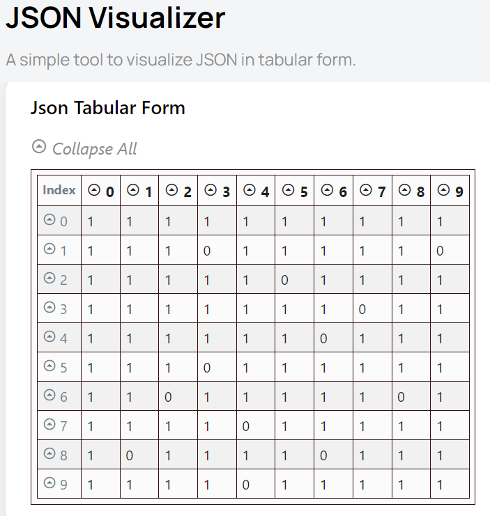

# Crossword

When you execute the script extractCrossword.py, it generates a JSON file containing the binary matrix. You can use https://www.jsonvisual.com/ to visualize the structure of this matrix and verify if it accurately represents the crossword puzzle from the image.

image: 
image2

matrix:
